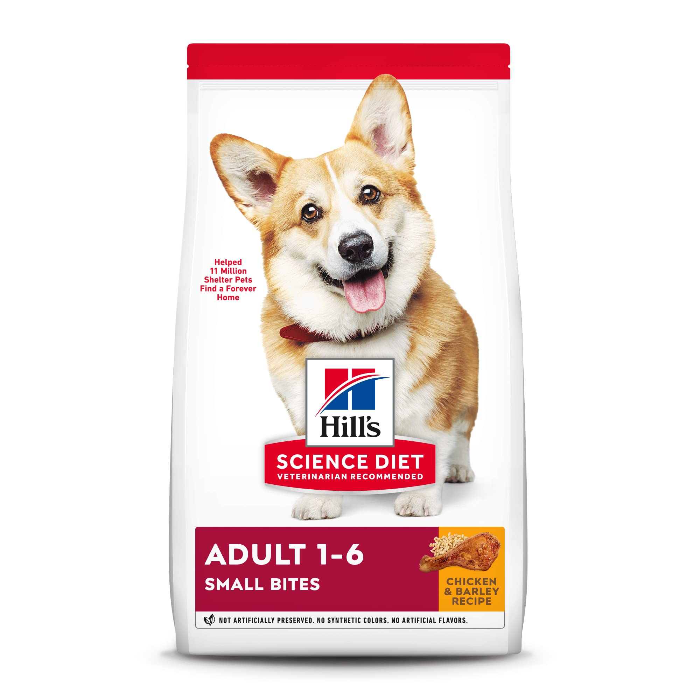

# Food

## Regular Meal Directions

Finn gets 45-50 grams of dog food twice per day. If you don't have a food scale, it's about 1/2 cup.

He normally eats in the morning when he wakes up and then at 4:00pm. He will remind you about this afternoon meal. If you aren't going to be home, he can eat later in the evening without any problems.

